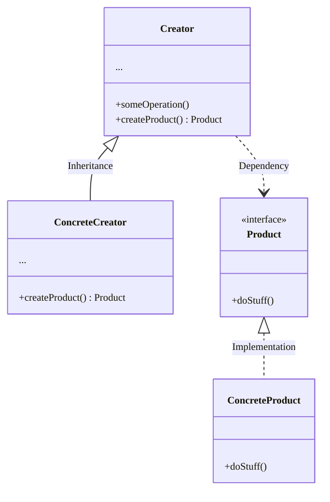
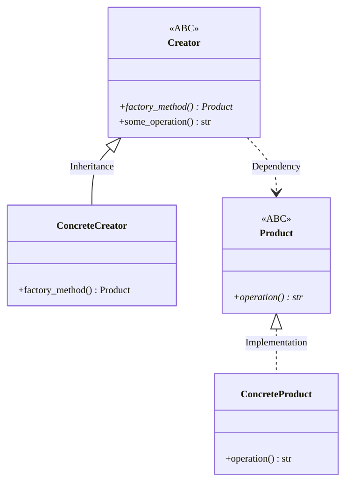

Delegate a specialized function/method to create instances.

### Diagram




### Code Example

```python
from __future__ import annotations
from abc import ABC, abstractmethod


class Product(ABC):

    @abstractmethod
    def operation(self) -> str:
        pass


class Creator(ABC):

    @abstractmethod
    def factory_method(self) -> Product:
        pass

    def some_operation(self) -> str:
        product = self.factory_method()
        result = f"Creator: working with {product.operation()}."
        return result


class ConcreteProduct(Product):

    def operation(self) -> str:
        return "Result of ConcreteProduct."


class ConcreteCreator(Creator):

    def factory_method(self) -> Product:
        return ConcreteProduct()
```



